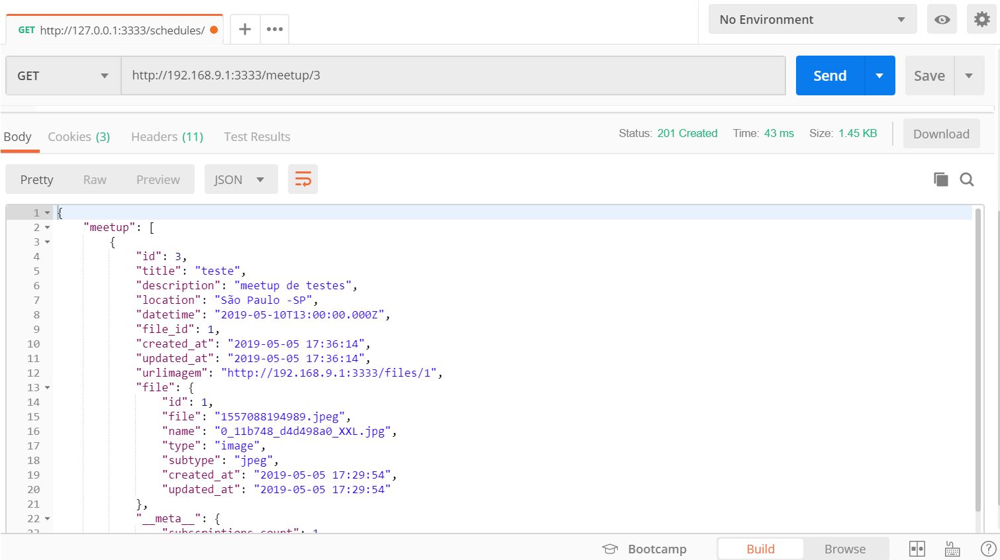
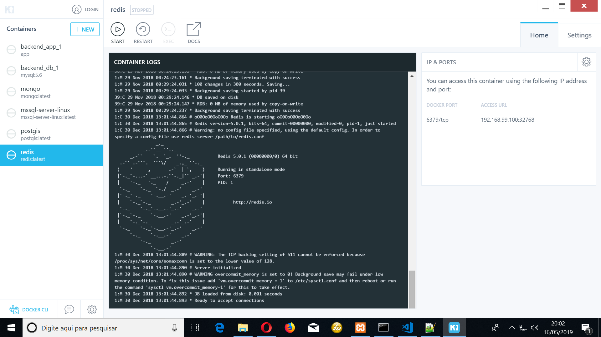
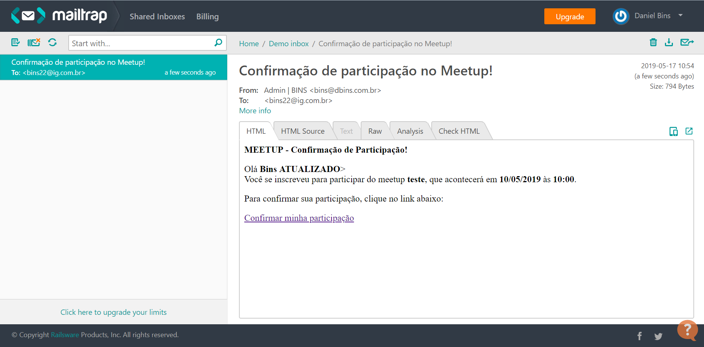

# DESAFIO FINAL - Backend Meetapp

Este é o backend feito em AdonisJS com banco de dados MySQL. Este backend faz parte do desafio final do bootcamp 4 da Rocketseat. Este backend será consumido por uma aplicativo feito em React Native.

O aplicativo pode ser visto neste link:

https://github.com/dbins/rocketseat_mobile



## Requisitos Funcionais

**Usuário/Autenticação**

- O usuário deve poder se cadastrar com nome, e-mail e senha;
- O usuário deve poder realizar login utilizando e-mail e senha;
- O usuário deve poder escolher suas preferências de tecnologias no primeiro login ou alterando seu perfil;
- O usuário deve poder editar seu perfil, alterando nome, senha e preferências;

**Meetups**

- O usuário deve poder listar os próximos meetups que ainda não é inscrito;
- O usuário deve poder listar os meetups os quais está inscrito e acontecerão em breve;
- O usuário deve poder listar os próximos meetups recomendados (de acordo com suas preferências) que ainda não é inscrito;
- O usuário deve poder visualizar detalhes do evento como foto de capa, título, descrição, número de inscritos e local de realização;
- O usuário deve poder cadastrar um novo meetup;
- O usuário deve poder realizar inscrição no meetup;
- O usuário deve poder buscar por meetups pelo título;
- As preferências são fixas e não podem ser alteradas: Front-end, Back-end, Mobile, DevOps, Gestão e Marketing (salve-as em uma tabela do banco de dados);
- Ao se inscrever no meetup, o usuário recebe um e-mail de confirmação de participação;
- Os e-mails devem ser enviados através de uma fila com Redis/Kue;

## Instalação

- git clone https://github.com/dbins/rocketseat_backend.git
- npm install
- Criar o banco de dados vazio no MySQL (nome: desafio4)
- Alterar as configurações de conexão com o banco de dados no arquivo .env localizado na raiz do projeto
- Rodar a migration: adonis migration:run
- Rodar a carga inicia de dados (seed): adonis seed
- Para ativar o servidor: adonis serve --dev
- O servidor vai subir no endereço http://127.0.0.1:3333. Isso pode ser alterado no arquivo .env localizado na raiz do projeto.

## Redis

- No Windows 10, foi utilizado o Kitematic (Alpha) para gerenciar os containers
- Baixar o container Redis
- Iniciar o container Redis
- Editar o arquivo config/redis.js. No objeto local, colocar dados de conexão
- No arquivo .env localizado na raiz do projeto, configurar o REDIS_HOST
- No arquivo .env, localizado na raiz do projeto, colocar as credenciais de email MAIL_HOST - MAIL_PORT - MAIL_USER - MAIL_PASS
- Depois de iniciar o servidor, numa janela de terminal em separado, dentro da pasta do projeto, executar:
  adonis kue:listen

  
  

## Rotas da aplicação

Para ver as rotas e o formato das requisições, consulte a documentação disponível no arquivo index.html localizado na raiz do projeto. Esta documentação foi criada usando a API Blueprint, o arquivo com a documentação se chama api.md e fica na raiz do projeto.

Existe uma versão da documentação no formato Swagger, na raiz do projeto existe um arquivo chamado swagger.json. Foram feitos testes unitários com base na documentação utilizando Dredd.

Um resumo das rotas pode ser visto abaixo:

| Rota                 | Método | Descrição                      |
| -------------------- | ------ | ------------------------------ |
| /register            | POST   | Criar usuário                  |
| /login               | POST   | Gerar Token                    |
| /preferences         | GET    | Preferências do sistema        |
| /preferences/save    | POST   | Salvar Preferências do Usuário |
| /profile             | GET    | Perfil do Usuário              |
| /profile             | PUT    | Salvar Perfil do Usuário       |
| /files               | POST   | Salvar Imagem do Meetup        |
| /files/:id           | GET    | Recuperar Imagem               |
| /files/:id           | DELETE | Excluir Imagem                 |
| /dashboard           | GET    | Dados dos Meetups              |
| /meetup/:id          | GET    | Dado de um Meetup              |
| /meetup              | POST   | Criar Meetup                   |
| /meetup/subscription | POST   | Inscrição no Meetup            |
| /meetup/confirmation | POST   | Confirmar Inscrição Meetup     |


## Comandos utilizados para criar o projeto

```
adonis new backend
adonis make:model User -m -c
adonis make:model Token -m -c
adonis make:model Preference -m -c
adonis make:model UserPreference -m -c
adonis make:model File -m -c
adonis make:model Meetup -m -c
adonis make:model MeetupPreference -m -c
adonis make:model MeetupUser -m -c
adonis make:controller Session
adonis install @adonisjs/mail
adonis install @adonisjs/redis
adonis make:job MeetupEmail
adonis make:validator Login
adonis make:validator User
adonis make:validator Preferences
adonis make:validator UserUpdate
adonis make:validator Subscription
adonis make:Meetup
adonis make:Confirmation
adonis install @adonisjs/drive
adonis make:ehandler
adonis install @adonisjs/http-logger
```
